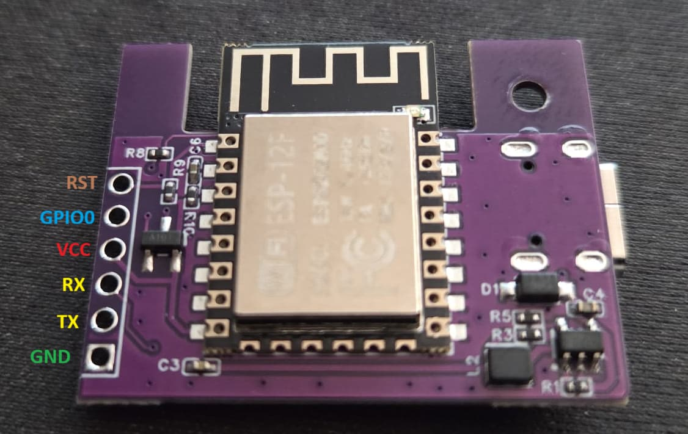

# First-Time Flashing Guide

This guide will walk you through flashing the firmware onto your GeekMagic SmallTV Smart Weather Clock for the first time using a USB-to-TTL converter.

## ⚠️ Important Notes

- **First-time flashing must be done via UART/USB-to-TTL converter** - OTA updates will not work until the firmware is initially installed
- **The USB-to-TTL converter is used ONLY for communication** - Do NOT power the board through the USB-to-TTL converter
- **Always set the USB-to-TTL converter to 3.3V** - Using 5V will damage your ESP8266 board
- **TX connects to RX and RX connects to TX** - This is a common mistake! The connections are crossed

## Prerequisites

Before you begin, make sure you have:

1. **GeekMagic SmallTV Smart Weather Clock** (ESP8266-based device)
2. **USB-to-TTL Converter** (e.g., CP2102, CH340, FT232RL, or similar)
3. **Regular USB power cable** (for powering the board - this is separate from the USB-to-TTL converter)
4. **USB power adapter** (wall adapter or computer USB port)
5. **Jumper wires** (female-to-female or male-to-female, depending on your board's pin headers)
6. **Computer** with:
   - **Modern web browser** (Chrome, Edge, or Firefox recommended for ESPHome Flasher)
   - **Firmware file** (`firmware.bin`) - either:
     - Pre-built firmware from a release (if available)
     - Or build it yourself using PlatformIO (see [BUILD.md](BUILD.md) for installation instructions)

**Note:** You don't need PlatformIO installed if you're using ESPHome Flasher and already have a `firmware.bin` file. PlatformIO is only required if you need to build the firmware from source code.

## Step 1: Identify the UART Connector on Your Board

The pinout diagram below shows the 6-pin connector block on your board used for UART communication and flashing:



For the GeekMagic SmallTV Smart Weather Clock, this guide uses the **6-pin board connector** (you can also connect directly to GPIO pins if preferred). The connector provides access to:
- **TX** - Transmit pin (connects to GPIO1 internally), sends data from ESP8266 to USB-to-TTL converter
- **RX** - Receive pin (connects to GPIO3 internally), receives data from USB-to-TTL converter to ESP8266
- **GND** - Ground pin, common ground reference
- **GPIO0** - Used to enter flash mode when connected to GND
- **3.3V** - Power pin (we won't use this - the board is powered via separate USB cable)
- Additional pin(s) as shown in the pinout diagram

Refer to the pinout diagram above to identify which connector pin corresponds to TX, RX, GND, and GPIO0.

## Step 2: Configure Your USB-to-TTL Converter

**⚠️ CRITICAL: Set the voltage jumper to 3.3V**

Most USB-to-TTL converters have a small jumper or switch that selects between 3.3V and 5V. **You MUST set this to 3.3V**. Using 5V will permanently damage your ESP8266 board.

1. Locate the voltage selection jumper on your USB-to-TTL converter
2. Move the jumper to the **3.3V position** (not 5V)
3. Double-check this setting before connecting anything

Common USB-to-TTL converter types:
- **CP2102**: Usually has a small jumper labeled "3.3V" and "5V"
- **CH340**: May have a switch or jumper
- **FT232RL**: Check for voltage selection jumper

## Step 3: Wire the Connections

**⚠️ IMPORTANT: The board must be powered separately with a regular USB power cable. Do NOT power it through the USB-to-TTL converter.**

### Power Connection (Separate USB Cable)
1. Connect the **regular USB power cable** to the board's USB port
2. Connect the other end to a **USB power adapter** (wall adapter) or computer USB port
3. **Do NOT plug this in yet** - wait until all connections are made

### USB-to-TTL Connections (Communication Only)

Connect the USB-to-TTL converter to the board's 6-pin connector block using jumper wires:

| USB-to-TTL Converter | Board Connector Pin | Notes |
|---------------------|---------------------|-------|
| **TX** | **RX** (on connector block) | ⚠️ TX goes to RX (crossed!) |
| **RX** | **TX** (on connector block) | ⚠️ RX goes to TX (crossed!) |
| **GND** | **GND** (on connector block) | Ground connection |

**⚠️ Common Mistake:** Many beginners connect TX to TX and RX to RX. This is incorrect! The connections must be **crossed**:
- USB-to-TTL **TX** → Board connector block **RX** pin
- USB-to-TTL **RX** → Board connector block **TX** pin

**Note:** All connections in this guide are made to the **6-pin connector block** on the board. Refer to the pinout diagram in Step 1 to identify the correct connector pins.

### Flash Mode Connection (Required for Flashing)

To put the board into flash mode, you need to connect GPIO0 to GND on the connector block:

| Board Connector Pin | Board Connector Pin | Notes |
|-------------------|---------------------|-------|
| **GPIO0** | **GND** | Connect GPIO0 to GND to enter flash mode |

**Important:** 
- This connection is made **on the board itself** between two pins on the 6-pin connector block
- Connect **GPIO0 connector pin** to **GND connector pin** using a jumper wire
- This connection must be in place **before powering on** the board to enter flash mode
- It's convenient to leave it connected during flashing, then disconnect after flashing is complete

**Do NOT connect:**
- USB-to-TTL **VCC/3.3V** to the board (we're using separate USB power)
- USB-to-TTL **5V** to anything (should be set to 3.3V anyway)

### Visual Connection Guide

```
┌─────────────────────┐         ┌──────────────────────┐
│  USB-to-TTL         │         │  GeekMagic Board     │
│  Converter          │         │  (6-pin connector)   │
├─────────────────────┤         ├──────────────────────┤
│                     │         │                      │
│  TX ────────────────┼────────→│  RX                  │
│                     │         │                      │
│  RX ←───────────────┼─────────│  TX                  │
│                     │         │                      │
│  GND ───────────────┼─────────│  GND ───┐            │
│                     │         │         │            │
│  VCC (not used)     │         │         │            │
│                     │         │         │            │
│  USB                │         │  GPIO0 ←┘            │
│  (to computer)      │         │  (jumper wire)       │
└─────────────────────┘         │                      │
                                │  USB Power Cable ────┼─── (to power adapter)
                                └──────────────────────┘
```

**Connection Summary:**
- **USB-to-TTL TX** → **Board RX** (connector pin)
- **USB-to-TTL RX** → **Board TX** (connector pin)  
- **USB-to-TTL GND** → **Board GND** (connector pin)
- **Board GPIO0** → **Board GND** (jumper wire on connector block)
- **Board USB** → **USB Power Cable** (separate power source)

**Note:** All connections are made to the **6-pin connector block** on the GeekMagic board. The GPIO0-to-GND jumper wire connects two pins on the same connector block.

## Step 4: Connect Everything

1. **First**, connect all the jumper wires:
   - USB-to-TTL **TX** → Board connector block **RX**
   - USB-to-TTL **RX** → Board connector block **TX**
   - USB-to-TTL **GND** → Board connector block **GND**
   - **Board connector block GPIO0** → **Board connector block GND** (for flash mode)
2. **Then**, connect the USB-to-TTL converter to your computer via USB
3. **Finally**, plug in the USB power cable to power the board

**Order matters:** 
- Make sure the USB-to-TTL converter is connected to your computer before powering on the board. This ensures proper communication.
- The **GPIO0-to-GND connection must be in place before powering on** the board to enter flash mode.

## Step 5: Get the Firmware File

You need a `firmware.bin` file to flash. You have two options:

### Option A: Use Pre-built Firmware (Easiest)

If a pre-built firmware is available (e.g., from a GitHub release):
1. Download the `firmware.bin` file
2. Note the location where you saved it
3. Skip to Step 6 to flash it

### Option B: Build the Firmware Yourself

If you need to build the firmware from source code:

**Prerequisites:** You'll need PlatformIO installed (see [BUILD.md](BUILD.md) for installation instructions).

```bash
# Navigate to the project directory
cd /path/to/geekmagic-tv-esp8266

# Build the firmware
pio run
```

This will create the firmware binary at: `.pio/build/nodemcuv2/firmware.bin`

**Note:** You'll need the path to this `firmware.bin` file for the flashing process in the next step.

## Step 6: Flash the Firmware Using ESPHome Flasher

We'll use [ESPHome Flasher](https://web.esphome.io/) - a web-based tool that makes flashing ESP8266 devices simple and user-friendly. This method works on any operating system and doesn't require installing additional drivers or tools.

### Step 6.1: Open ESPHome Flasher

1. Open your web browser (Chrome, Firefox, Edge, or Safari)
2. Navigate to: **https://web.esphome.io/**
3. You should see the ESPHome Flasher interface

### Step 6.2: Connect to Your USB-to-TTL Converter

1. Make sure your USB-to-TTL converter is connected to your computer
2. In the ESPHome Flasher interface, click the **"Connect"** button
3. Your browser will ask for permission to access serial ports - click **"Allow"** or **"Connect"**
4. A list of available serial ports will appear
5. Select your USB-to-TTL converter from the list:
   - **Linux**: Usually `/dev/ttyUSB0` or `/dev/ttyACM0`
   - **macOS**: Usually `/dev/cu.usbserial-*` or `/dev/cu.SLAB_USBtoUART`
   - **Windows**: Usually `COM3`, `COM4`, or similar

**Troubleshooting:** If you don't see your device:
- Make sure the USB-to-TTL converter is properly connected
- Try unplugging and reconnecting the USB cable
- **Linux users:** You may need to set permissions for the serial port (see Troubleshooting section below)
- Check if drivers are installed (see Troubleshooting section)
- Try refreshing the page and clicking "Connect" again

### Step 6.3: Select the Firmware File

1. Click the **"Install"** or **"Choose file"** button (the exact label may vary)
2. Navigate to your project directory: `/path/to/geekmagic-tv-esp8266/.pio/build/nodemcuv2/`
3. Select the file: **`firmware.bin`**
4. The file should now be loaded and ready to flash

### Step 6.4: Verify Flash Mode Connection

Before flashing, verify that the board is ready:

1. **Check GPIO0-to-GND connection** - Make sure the GPIO0 connector pin is connected to the GND connector pin on the 6-pin connector block (this should already be done from Step 4)

2. **Power on the board** (if not already powered on)
   - Plug in the USB power cable to power the board
   - The board will boot into flash mode automatically with GPIO0 connected to GND

**Note:** The GPIO0-to-GND connection must be in place when you power on the board. It's convenient to leave it connected during flashing, then disconnect after flashing is complete.

### Step 6.5: Start the Flashing Process

1. In ESPHome Flasher, click the **"Flash ESP"** or **"Install"** button
2. The flashing process will begin - you'll see progress messages
3. Wait for the process to complete - this typically takes 30-60 seconds

**What you'll see:**
- Progress bar showing flash progress
- Status messages like "Connecting...", "Erasing flash...", "Writing flash...", "Verifying..."
- Success message when complete

### Step 6.6: Verify Successful Flash

After flashing completes, you should see a success message. The device will automatically reboot.

**If flashing fails:**
- Verify all connections are secure (TX→RX, RX→TX, GND→GND, GPIO0→GND) - all on the 6-pin connector block
- Check that the USB-to-TTL converter is set to 3.3V
- Try power cycling the board (unplug USB power, ensure GPIO0-to-GND is connected, then power on again)
- Try disconnecting and reconnecting the USB-to-TTL converter
- See the Troubleshooting section for more help

**After successful flash:**
- You can now disconnect the GPIO0-to-GND jumper wire
- The device will automatically reboot and should start in AP mode

## Alternative Flashing Methods

If ESPHome Flasher doesn't work for you, here are alternative methods:

### Method 2: Using PlatformIO (Command-line)

```bash
# Auto-detect port and upload
pio run -t upload

# Or specify the port manually
pio run -t upload --upload-port /dev/ttyUSB0    # Linux
pio run -t upload --upload-port /dev/cu.usbserial-*  # macOS
pio run -t upload --upload-port COM3            # Windows
```

### Method 3: Using esptool.py (Command-line)

```bash
# Install esptool if needed
pip install esptool

# Erase flash (recommended for first-time flash)
esptool.py --port /dev/ttyUSB0 erase_flash

# Upload firmware
esptool.py --port /dev/ttyUSB0 write_flash 0x0 .pio/build/nodemcuv2/firmware.bin
```

## Step 7: Monitor the Serial Output

After uploading, you can monitor the serial output to see if the device boots correctly. This helps verify that the firmware flashed successfully and the device is working properly.

### Using ESPHome Flasher (Easiest)

If you're still connected to ESPHome Flasher:
1. The serial monitor may be available in the same interface
2. Look for a "Serial Monitor" or "Logs" tab/button
3. You should see boot messages appear automatically

### Using PlatformIO

```bash
# Using PlatformIO
pio device monitor

# Or specify the port manually
pio device monitor --port /dev/ttyUSB0    # Linux
pio device monitor --port /dev/cu.usbserial-*  # macOS
pio device monitor --port COM3            # Windows
```

### Using Other Tools

```bash
# Using screen (Linux/macOS)
screen /dev/ttyUSB0 115200

# Using minicom (Linux)
minicom -D /dev/ttyUSB0 -b 115200

# Exit: Press Ctrl+A then K (screen) or Ctrl+A then X (minicom)
```

**What to look for:**
- Boot messages showing the firmware version
- WiFi initialization messages
- "AP Mode Active" message
- SSID and password for "SmartClock-Setup" network
- IP address information

**Baud rate:** 115200 (as configured in `platformio.ini`)

If you see error messages or the device doesn't boot, check the Troubleshooting section below.

## Step 8: Verify the Installation

1. **Check the display** - The device should show "AP Mode Active" with WiFi credentials
2. **Look for the WiFi network** - You should see "SmartClock-Setup" in your WiFi networks
3. **Connect to the AP** - Use the password shown on the device display
4. **Access the web interface** - Navigate to `http://192.168.4.1` (or the IP shown on the display)

If everything works, proceed to configure WiFi and complete the setup as described in [README.md](README.md).

## Troubleshooting

### ESPHome Flasher: "No serial ports found" or Port Not Appearing

**Solutions:**
1. **Browser permissions** - Make sure you clicked "Allow" when the browser asked for serial port access
2. **Linux permissions** - If you're on Linux and the port appears but can't be accessed:
   ```bash
   sudo setfacl -m u:$USER:rw /dev/ttyUSB0  # Replace ttyUSB0 with your port
   ```
   This grants your user read/write access to the serial port. See the "Device Not Found" section below for alternative permission methods.
3. **Browser compatibility** - ESPHome Flasher works best with Chrome, Edge, or Firefox. Safari may have limited support
4. **USB connection** - Try unplugging and reconnecting the USB-to-TTL converter
5. **Close other programs** - Close any other programs that might be using the serial port (Arduino IDE, PlatformIO, etc.)
6. **Refresh the page** - Sometimes refreshing the ESPHome Flasher page helps
7. **Check Device Manager (Windows)** - Verify the device appears in Device Manager under "Ports (COM & LPT)"
8. **Install drivers** - Install the correct USB-to-TTL driver:
   - CH340: Install CH340 driver
   - CP2102: Install CP2102 driver
   - FT232RL: Usually works with default drivers

### Upload Fails: "Failed to connect to ESP8266"

**Possible causes:**
1. **Wrong serial port** - Make sure you selected the correct port in ESPHome Flasher
2. **Board not in flash mode** - Verify GPIO0-to-GND connection is secure on the connector block and power cycle the board
3. **Timing issue** - Make sure the board is powered on with GPIO0-to-GND connected before clicking "Flash ESP"
4. **Connection issues** - Verify TX→RX and RX→TX connections are correct (crossed)
5. **Voltage setting** - Double-check USB-to-TTL converter is set to 3.3V (not 5V)

### Upload Fails: "Timed out waiting for packet header"

**Solutions:**
1. Verify the GPIO0-to-GND connection is secure and making good contact on the connector block
2. Check that TX→RX and RX→TX connections are correct (crossed)
3. Verify the USB-to-TTL converter is set to 3.3V
4. Try power cycling: unplug USB power, ensure GPIO0-to-GND is connected, then power on again before retrying

### Device Doesn't Boot After Flash

**Solutions:**
1. **Check serial monitor** - Look for error messages
2. **Try erasing flash first**:
   ```bash
   esptool.py --port /dev/ttyUSB0 erase_flash
   ```
   Then re-flash the firmware
3. **Verify power** - Make sure the board is powered via USB power cable
4. **Check connections** - Verify all wires are secure

### ESPHome Flasher: Browser Compatibility Issues

**Browser Requirements:**
- **Chrome/Chromium** (recommended) - Full support for Web Serial API
- **Microsoft Edge** - Full support (Chromium-based)
- **Firefox** - Good support
- **Safari** - Limited support (may not work on all systems)

**If ESPHome Flasher doesn't work in your browser:**
1. Try a different browser (Chrome is most reliable)
2. Make sure your browser is up to date
3. Check if Web Serial API is supported: visit `chrome://flags` and search for "Serial" (Chrome/Edge)
4. As a fallback, use PlatformIO or esptool.py (see Alternative Methods above)

### "Device Not Found" or Port Not Appearing

**Solutions:**
1. **Check USB connection** - Try a different USB port or cable
2. **Install drivers** - Install the USB-to-TTL converter driver:
   - **Windows**: Download from manufacturer's website
   - **macOS**: Usually works automatically, but may need CH340/CP2102 drivers
   - **Linux**: Usually works automatically with `modprobe`:
     ```bash
     sudo modprobe ch341  # For CH340
     sudo modprobe cp210x  # For CP2102
     ```
3. **Check permissions** (Linux):
   
   If ESPHome Flasher can't access the serial port, you need to set permissions. Try one of these methods:
   
   **Method 1: Using setfacl (recommended for ESPHome Flasher):**
   ```bash
   sudo setfacl -m u:$USER:rw /dev/ttyUSB0  # Replace ttyUSB0 with your port
   ```
   
   **Method 2: Using usermod (requires logout/login):**
   ```bash
   sudo usermod -a -G dialout $USER
   # Log out and back in for changes to take effect
   ```
   
   **Method 3: Using chmod (temporary, resets after reboot):**
   ```bash
   sudo chmod 666 /dev/ttyUSB0  # Replace with your port
   ```
   
   **Note:** Replace `/dev/ttyUSB0` with your actual port (e.g., `/dev/ttyACM0`). The `setfacl` method works immediately and is recommended for web-based tools like ESPHome Flasher.
4. **Try different USB-to-TTL converter** - Some devices have compatibility issues
5. **Close other programs** - Make sure no other program is using the serial port

### Board Gets Hot or Doesn't Power On

**⚠️ STOP IMMEDIATELY** - This usually means:
1. **USB-to-TTL converter is set to 5V** - Check and switch to 3.3V
2. **Wrong power connection** - Verify you're using the separate USB power cable, not the USB-to-TTL converter's power
3. **Short circuit** - Check for loose wires or incorrect connections

### Can't Enter Flash Mode

**Solutions:**
1. **Verify GPIO0-to-GND connection** - Make sure the GPIO0 connector pin is connected to the GND connector pin on the 6-pin connector block (refer to Step 3)
2. **Check connection timing** - The GPIO0-to-GND connection must be in place BEFORE powering on the board
3. **Verify connection quality** - Check that the jumper wire is making good contact with the connector pins
4. **Refer to pinout** - Check the pinout diagram in Step 1 to ensure you're using the correct connector pins

## Safety Reminders

- ✅ **Always use 3.3V** on the USB-to-TTL converter (never 5V)
- ✅ **Power the board separately** with a USB power cable (not through USB-to-TTL)
- ✅ **Cross the TX/RX connections** (TX→RX, RX→TX)
- ✅ **Double-check all connections** before powering on
- ✅ **Disconnect power** before making or changing connections

## Next Steps

After successfully flashing the firmware:

1. Follow the "First boot" section in [README.md](README.md)
2. Configure WiFi through the captive portal
3. Set up your timezone and brightness preferences
4. For future updates, you can use OTA (Over-The-Air) updates via the web interface

## Additional Resources

- [BUILD.md](BUILD.md) - Detailed build instructions
- [README.md](README.md) - Project overview and usage
- [INSTALL.md](INSTALL.md) - Installation and setup guide
- [PlatformIO Documentation](https://docs.platformio.org/)
- [ESP8266 Arduino Core](https://arduino-esp8266.readthedocs.io/)

## Summary Checklist

Before starting, make sure you have:
- [ ] USB-to-TTL converter set to **3.3V** (not 5V)
- [ ] Regular USB power cable for the board
- [ ] Jumper wires ready
- [ ] USB-to-TTL converter connected to computer
- [ ] TX→RX and RX→TX connections made (crossed) on the 6-pin connector block
- [ ] GND connected between USB-to-TTL and board connector block
- [ ] **GPIO0-to-GND jumper wire** connected on the board's connector block (for flash mode)
- [ ] Board powered via separate USB cable
- [ ] **Firmware file** (`firmware.bin`) - either pre-built or built yourself
- [ ] Modern web browser (Chrome, Edge, or Firefox) for ESPHome Flasher
- [ ] (Optional) PlatformIO installed - only if building firmware from source

Good luck with your first flash! 🚀
